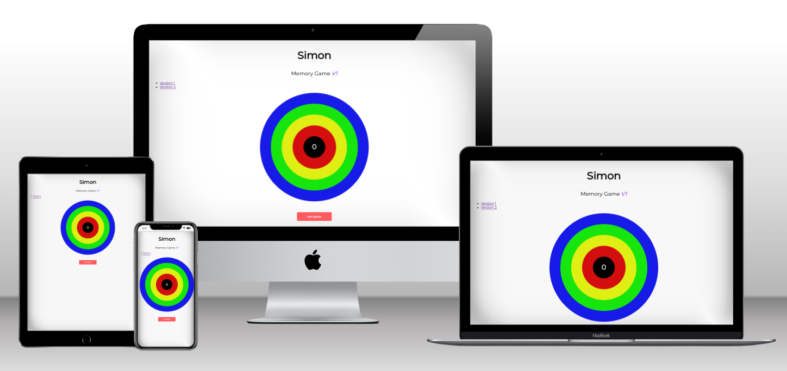
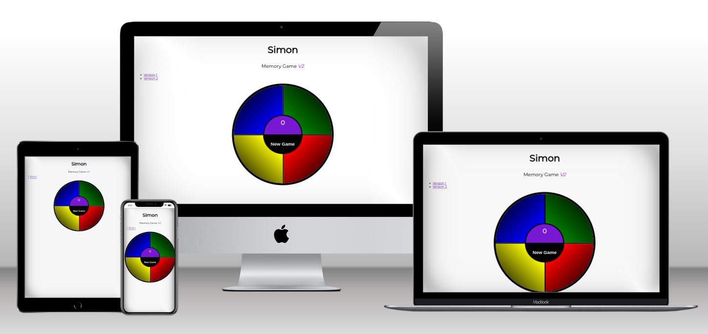
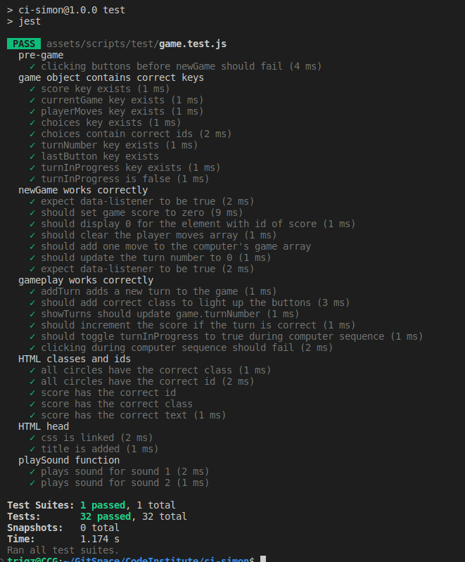

# Simon Memory Game with Jest Testing

This project is a Simon memory game implemented in JavaScript, with a primary focus on using Jest for testing. The game consists of a series of colored buttons that light up in a specific sequence. The player must replicate the sequence by clicking the buttons in the correct order.

The deployed game can be found [here](https://taherccg.github.io/ci-simon/index.html)

## Version
The initial iteration of the Simon game, [Version 1](https://taherccg.github.io/ci-simon/index.html), was developed following a step-by-step video tutorial. While it provided a functional implementation, it lacked certain aspects of user experience optimisation. In [Version 2](https://taherccg.github.io/ci-simon/index-v2.html), I took the opportunity to redesign the game, focusing on enhancing user interaction, improving visual appeal, and gameplay. This redesign aimed to create a more intuitive and enjoyable experience for players, incorporating feedback and lessons learned from the initial version. I have added nav links to both of the versions game page. 

### Version 1 Mockup

### Version 2 Mockup

## Features

- Randomly generated sequences of colors.
- Increasing difficulty level as the game progresses.
- New Game button to begin a new game or reset the current game.
- Sequence playback: The game will play a sequence of colors/sounds that the player must replicate.
- Player input: Players can click on colored buttons to replicate the sequence they heard.
- Visual and auditory feedback: The game provides feedback through color changes and sounds to indicate correct and incorrect moves.
- Additional feature to navigate from version 1 to version 2 as nav links

## Technologies Used
- HTML/CSS/JavaScript: Frontend development of the game.
- Jest: JavaScript testing framework used for unit testing.

## Installation

To run the game locally, follow these steps:

1. Clone the repository:

<code>
git clone https://github.com/your-username/simon-memory-game.git
</code>

2. Navigate to the project directory:

<code>
cd simon-memory-game
</code>

3. Open the index.html file in your web browser to play the game.

## Technologies Used
- HTML/CSS/JavaScript: Frontend development of the game.
- Jest: JavaScript testing framework used for unit testing.

## Testing Simon Memory Game with Jest

This project utilises Jest, a delightful JavaScript testing framework, to ensure the correctness and reliability of the Simon memory game's functionality.

## Running Tests

To run Jest tests for the Simon memory game, follow these steps:

1. Install dependencies:

<code>
npm install
</code>
 
 

2. Install Jest as a development dependency:

<code>
npm install --save-dev jest
</code>
 
 

3. JSDOM environment for Jest.

<code>
npm install --save-dev jest-environment-jsdom
</code>
 
 

4. Run Tests
   
<code>
npm test
</code>
 
 

## Writing Test Cases

When writing test cases for the Simon memory game, most of the test cases was followed along the Code Institute, covering various scenarios and edge cases to ensure comprehensive test coverage. For example:

- Test different sequences of colors to ensure the game generates and displays them correctly.
- Test player input validation to ensure the game accurately detects correct and incorrect responses.
- Test game state transitions to ensure the game progresses correctly through different stages (e.g., starting a new game, advancing to the next level).

I added some test cases, as I was learning Jest. I tested:
- If the css file was linked to index html.
- Title of the HTML.
- Tested mockup sounds, to see if they were working correctly.
- I also added other challenge tests set out in the follow along video.

To see all test cases, [Click Here](https://github.com/TaherCCG/ci-simon/blob/main/assets/scripts/test/game.test.js)

## Results of Tests

Both versions pass the test as both version use the same JS file and functionality.

## Extra help with testing 
I received additional assistance with testing the game, as my two children, aged 7 and 10, eagerly participated in evaluating the user experience. They thoroughly enjoyed playing the game and provided valuable feedback. Both of them expressed a preference for Version 2, noting that it offers a larger click area, which enhances gameplay for them.

## Conclusion
Testing with Jest has been a great experience for me. It allowed me to validate the functionality of my Simon memory game, identify bugs early in the development process, and ensure a high level of software quality. For my future projects, I will most likely continue to use Jest for testing my projects. By writing comprehensive test cases and running them regularly, I can build robust and reliable software that provides an enjoyable experience for users.

For more information on Jest, including advanced features and best practices, I can always refer to the official [Jest documentation.](https://jestjs.io/)

## Acknowledgements
- The Simon Memory Game concept was created by Ralph H. Baer and Howard J. Morrison.
- [Code Institute](https://codeinstitute.net/) Introduction to Testing - follow along video by Matt Rudge senior product developer with Code Institute.
- Sound Effects from <a href="https://pixabay.com/sound-effects/?utm_source=link-attribution&utm_medium=referral&utm_campaign=music&utm_content=38299">Pixabay</a>
  